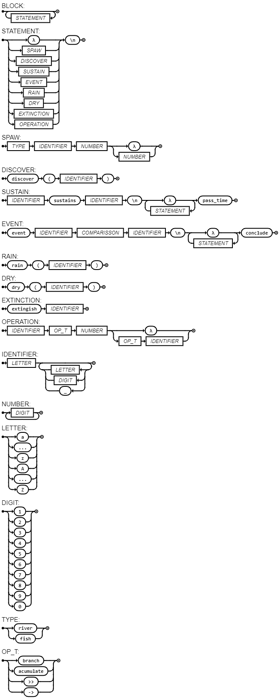

# Linguagem Autoral Aqua LogComp

## Oficial documentation:

https://rodrigoanciaes.github.io/Aqua-Documentation/

## Compilador e exemplos

O compilador e exemplos de código se encontram na pasta Compiler.

## Apresentação

Slides de apresentação: [Slides](docs/Apresentacao_Linguagem_de_Programação_Aqua.pdf)

## EBNF

``` 
BLOCK = { STATEMENT };
STATEMENT = ( "λ" | SPAWN | DISCOVER | SUSTAIN | EVENT | RAIN | DRY | EXTINCTION | OPERATION ), "\n" ;
SPAWN = TYPE, IDENTIFIER, "create", ( "λ" | NUMBER | NUMBER, ",", NUMBER ) ;
DISCOVER = "discover", "(", IDENTIFIER, ")" ;
SUSTAIN = IDENTIFIER, "sustains", IDENTIFIER, "\n", "λ", { ( STATEMENT ), "λ" }, "pass_time" ;
EVENT = "event", IDENTIFIER, COMPARISSON, IDENTIFIER, "\n", "λ", { ( STATEMENT ), "λ" }, "conclude" ;
RAIN = "rain","(", IDENTIFIER, ")" ;
DRY = "dry","(", IDENTIFIER, ")" ;
EXTINCTION = "extinguish", IDENTIFIER ; 
OPERATION = IDENTIFIER, OP_T, NUMBER, ( "λ" | OP_T, IDENTIFIER ) ;
IDENTIFIER = LETTER, { LETTER | DIGIT | "_" } ;
NUMBER = DIGIT, { DIGIT } ;
LETTER = ( "a" | "..." | "z" | "A" | "..." | "Z" ) ;
DIGIT = ( "1" | "2" | "3" | "4" | "5" | "6" | "7" | "8" | "9" | "0" );
TYPE = ( "river" | "fish" ) ;
OP_T = ( "branch" | "acumulate" | ">>" | "->" ) ;

```

## Diagrama Sintático



## Introdução

A linguagem Aqua desenvolvida para a matéria Lógica Computacional, é uma linguagem que simula o mundo natural ao escrever o código, para programar nessa linguagem é necessário criar connjuntos de rios e peixes e definir as relações entre eles. A linguagem é composta por 2 tipos de declarações, a declaração de rios, a declaração de peixes.

Observação: A linguagem não possui necessidade de identação, porém é recomendado para melhor visualização do código.

Um exemplo comentado de código em Aqua é:

```
river x create 10 --cria um rio com 10 de água

river y create 10

x >> 5 >> y -- O rio x transfere 5 de água para o rio y
discover(x) -- imprime 5
discover(y) -- imrime 15

x branch 5 -- O rio x se divide em 5 rios
discover(x) -- imprime 1
y >> 1 >> x -- O rio y transfere 1 de água para o rio x
x acumulate 5 -- x = x*5 (o rio x acumula 5 vezes a quantidade de água que ele tem)

fish z create 2,1 -- cria uma população de 2 que consome 1 por individuo
fish f create 1,1 -- cria uma população de 1 que consome 1 por individuo

x sustains z: -- enquanto x sustentar z 
-- para sustentar z é maior que 0 e z consome (reduz o valor de) x no valor de seu (consumoz*populaçãoz) e aumenta seu numero em (populaçãoz = populaçãoz + (populaçãoz-populaçãoz%2) + sub)
-- sub = dif se dif > 0 else 0
-- dif = populaçãox - populaçãoz*consumoz
y >> 1 >> x:
f -> z    -- f consome z para aumentar seu numero da mesma maneira do suatains
event z inf f -- caso população de z é inferior a f inicia um evento
extingish f -- f é extinto (delete f)
conclude -- fim do evento
pass_time -- passa o tempo (recomeça o loop)

rain(y) -- todos os rios recebem valor de agua equivalente quantidade em y

dry(x) -- todos os rios perdem valor de agua equivalente quantidade em x

```

Um exemplo limpo de código em Aqua é:

```
river x create 10
river y create 10
x >> 5 >> y
discover(x)
discover(y)
x branch 5
discover(x)
y >> 1 >> x
x acumulate 5
fish z create 2,1
fish f create 1,1
x sustains z:
y >> 1 >> x:
f -> z   
event z inf f 
extingish f
conclude
pass_time
rain(y)
dry(x)

```
